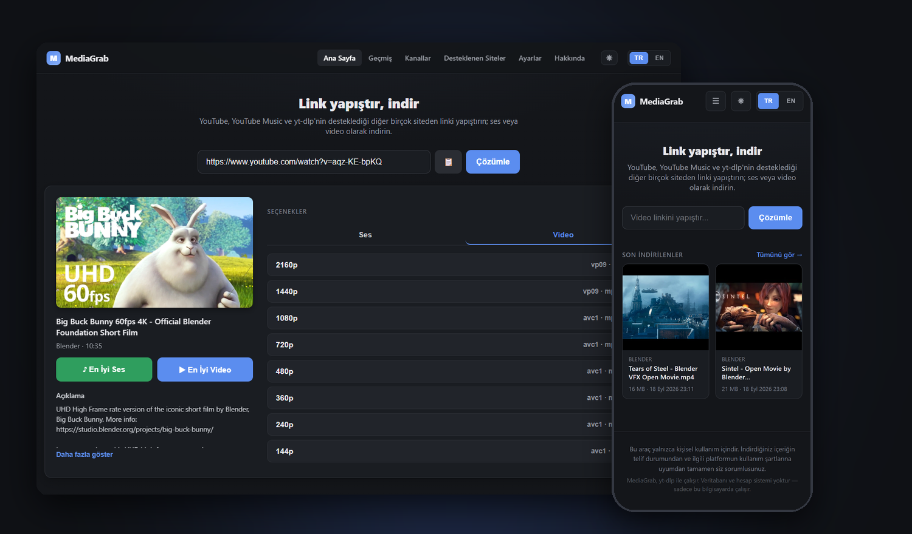

# MediaGrab

**[Latest Release: v2.1.0](https://github.com/umitkrkmz/mediagrab/releases/tag/v2.1.0)** · **[Changelog](CHANGELOG.md)** · **[License](LICENSE)**

---

**Türkçe:** Link yapıştır, indir. Lokalde çalışan, kişisel kullanım için video/ses indirme aracı. YouTube, YouTube Music ve yt-dlp'nin desteklediği 1700'den fazla siteden (Vimeo, SoundCloud, Twitch vb.) ses/video indirir; veritabanı, hesap sistemi veya bulut bağlantısı yoktur.

**English:** Paste a link, download it. A local, personal-use video/audio downloader. Works with YouTube, YouTube Music, and 1700+ other sites yt-dlp supports (Vimeo, SoundCloud, Twitch, and more) — no database, account system, or cloud connection.

## Öne çıkanlar / Highlights

- **TR:** Ses/video indirme, playlist ve kanal takibi · telefondan kullanım (QR kodla) · Raspberry Pi'de 7/24 ev sunucusu · Docker desteği · Türkçe/İngilizce arayüz
- **EN:** Audio/video downloads, playlists and channel following · use it from your phone (via QR code) · an always-on home server on a Raspberry Pi · Docker support · Turkish/English UI

## Kurulum / Installation

- **Windows, kolay yol:** [son sürümü indirin](https://github.com/umitkrkmz/mediagrab/releases/latest) (`MediaGrabSetup.exe`) ve çalıştırın.
- **Her platform, kaynak koddan:** `git clone` + `pip install -r requirements.txt` + `python run.py`.

Adım adım kurulum, sorun giderme, proje yapısı ve tüm özellik listesi için:

📖 **[Tam kılavuz — Türkçe](docs/README.tr.md)** · **[Full guide — English](docs/README.en.md)**

## Lisans

**v1.0.0 – v1.8.0:** [MIT](LICENSE-MIT). **v1.9.0 ve sonrası:** [GPL-3.0-or-later](LICENSE). Üçüncü taraf bağımlılıklar ve gerekçe için tam kılavuzdaki "Lisans" bölümüne bakın.

**v1.0.0 – v1.8.0:** [MIT](LICENSE-MIT). **v1.9.0 and later:** [GPL-3.0-or-later](LICENSE). See the "License" section in the full guide for third-party dependencies and the reasoning behind the switch.

## Yasal Uyarı / Legal Notice

**TR:** Bu araç yalnızca kişisel kullanım içindir. İndirdiğiniz içeriğin telif durumundan ve ilgili platformun kullanım şartlarına uyumdan siz sorumlusunuz.

**EN:** This tool is for personal use only. You are solely responsible for the copyright status of downloaded content and compliance with the relevant platform's terms of service.

---

Projeyi faydalı bulduysanız ⭐ vermeniz, başkalarının da bulmasına yardımcı olur. · If you find MediaGrab useful, a ⭐ helps other people find it.
